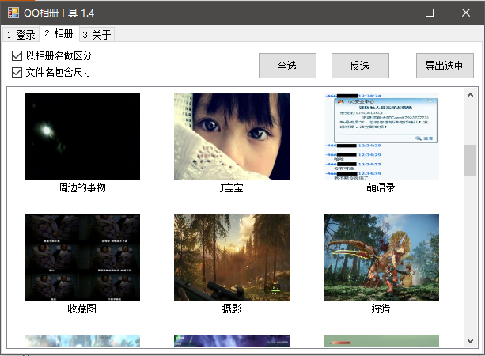

# QZAlbumTool 

​	QQ Zone album export tool

​	QQ空间相册批量导出工具

## 更新日志

## Version 1.4

时间：2019.11.03

日志：

1. 新增：保存时可选择以相册名作为文件夹存放相片。（感谢@ [h25019871990](https://github.com/h25019871990)在[issues1]( https://github.com/kahotv/QZAlbumTool/issues/1 )中的建议）
2. 修改：修复相册预览图失真的bug。
3. 修改：优化获取原图的方式。（感谢@ [h25019871990](https://github.com/h25019871990)在[issues1]( https://github.com/kahotv/QZAlbumTool/issues/1 )中的技术方案）

此项目后续应该不会再更新了，打算重构到另一个项目（[QZAlbumTool2]( https://github.com/kahotv/QZAlbumTool2)），会有更高的效率和更小的文件。

## Version 1.3

时间：2019.11.03

日志：

1. 修改：web控件由C#的原生WebBrowser换成CefSharp的ChromiumWebBrowser，解决js报错等兼容性问题。
2. 新增：下载**真正的原图**，之前版本下载的是比原图更次一级的大图。
3. 新增：下载原格式，上传的时候是什么格式下载就是什么格式**（例如.gif）**。
4. 新增：保存时可以选择加入图片尺寸。

CefSharp的文件可真多，不舒服

## Version 1.2

时间：2019.05.31

日志：

1. 修复严重bug，因取QQ号方法不对导致取不到相册列表。
2. 新增判断空相册逻辑。

## Version 1.1

时间：2019.05.28

日志：

​	1.优化UI布局

​	2.更新文档和图片

## Version 1.0

时间：2019.05.28

日志：

​	1.新增导出相册功能

​	2.优化查看相册列表速度

​	3.完善"关于"页面

## Version 0.1

时间：2019.05.28

日志：

​	1.只能看相册列表

## 当前功能

- 登录到QQ空间
  - 扫码登录
  - 快捷登录
  - 账号密码登录
- 获取相册列表
  - 展示到TagPage2里
- 导出选中的相册
  - 导出到指定的文件夹内

## 已知BUG和问题

- （BUG）无封面的相册不能获取
  - url转换没处理好。
- （问题）UI卡顿
  - 切换到相册时会卡UI，没有进度条显示。
  - 导出相册时会卡UI，没有进度条显示。

## 编译

​	本项目依赖了Newtonsoft.Json、CefSharp、CefSharp.Core、CefSharp.WinForms，自行使用NuGet添加这些库来编译。

## 使用

1. 登录

   扫码、快捷登录、账号密码登录都行。

2. 点击2.相册

   要多等一会儿，有点慢。界面不能拖动表示正在处理中，不要关闭程序。

   

## 感想

- 看起来是个小工具，但我写这个README.md就花了近一小时。做一件事和做好一件事是两码事。

- QQ相册的图片竟然不是https的，g_tk参数也是可重用的，且不需要cookie就能访问。这意味着：

  - 就算QQ主人空间锁了，你可以中间人拿到相册图片的URL，并进行重放攻击拿到图片。

  **说通俗点，你把空间设置为仅自己可见，当你打开相册里隐私照片的时候，黑客已经看到你的相册了。**

  这不是我遇到的首例安全漏洞，软件工程师们还是要认真对待安全问题呀。

  